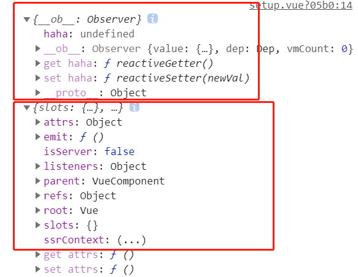

# vue2-composition-api

本文主要介绍在 `vue2` 中怎么使用 `composition-api`（组合式 API）

在 `vue2` 中使用 `composition-api` 需要使用到由官方提供的 [`@vue/composition-api` ](https://github.com/vuejs/composition-api/)插件。

安装：

```bash
npm install @vue/composition-api
# or
yarn add @vue/composition-api
```

使用：

```javascript
// main.js
import Vue from "vue";
import CompositionAPI from "@vue/composition-api";

Vue.use(CompositionAPI);
```

## setup

加入插件后，vue 组件就多了一个选项 setup，它是一个函数，是 composition api 的入口函数。

composition api 都要在 setup 函数中使用。

### setup的使用

```html
<template>
  <div class="content">
    total: {{ total }}
    <button @click="add">btn +1</button>
  </div>
</template>
<script>
import { ref } from "@vue/composition-api";
export default {
  setup() {
    const total = ref(0);
    const add = () => {
      total.value++;
    };
    // 暴露给template使用
    return {
      total,
      add
    };
  }
};
</script>
```

### setup参数

```html
<template>
  <div class="content">
    total: {{ total }}
    <button @click="add">btn +1</button>
  </div>
</template>
<script>
import { ref } from "@vue/composition-api";
export default {
  props: {
    haha: String
  },
  setup(props, context) {
    console.log(props, context);
    // 2个参数
    // props：
    // 响应式对象，是我们在组件中定义的 props
    // 不可解构 props 对象，这样做会使其失去响应性
    // const { msg } = props
    // context：
    // 上下文对象
    // 和我们以前在vue组件中使用的this有很大差别，context只保留了this的部分的属性，具体属性见图
    // 为什么只有部分属性？因为setup是在解析组件选项前被调用的
    // 在setup中不存在this，不可用
    const total = ref(0);
    const add = () => {
      total.value++;
    };
    return {
      total,
      add
    };
  }
};
</script>
```



### 调用（生命周期中）

经过测试，setup函数是在beforeCreate之后，created之前被调用。特别注意，在vue3中，setup函数是在beforeCreate之前被调用的。

### defineComponent

推荐使用defineComponent定义组件，具有友好的类型推断，尤其是使用typescript时。

```html
<template>
  <div class="content">
    total: {{ total }}
    <button @click="add">btn +1</button>
  </div>
</template>
<script>
import { defineComponent, ref } from "@vue/composition-api";
export default defineComponent({
  props: {
    msg: String
  },
  setup(props, context) {
    console.log(props, context);
    const total = ref(0);
    const add = () => {
      total.value++;
    };
    return {
      total,
      add
    };
  }
});
</script>
```

### render函数、tsx

```html
// 方式一
<script lang="tsx">
import { defineComponent, ref } from "@vue/composition-api";
export default defineComponent({
  setup() {
    const total = ref(0);
    const add = () => {
      total.value++;
    };
    return {
      total,
      add
    };
  },
  // 使用render函数
  render() {
    return (
      <div class="content">
        total: {this.total}
        <button on-click={this.add}>btn +1</button>
      </div>
    );
  }
});
</script>

// 方式二
<script lang="tsx">
import { defineComponent, ref, h } from "@vue/composition-api";
export default defineComponent({
  setup() {
    const total = ref(0);
    const add = () => {
      total.value++;
    };
    // 在setup中使用h
    return () =>
      h("div", [
        `total: ${total.value}`,
        h(
          "button",
          {
            on: {
              click: add
            }
          },
          "btn +1"
        )
      ]);
  }
});
</script>

// 方式三
<script lang="tsx">
import { defineComponent, ref, h } from "@vue/composition-api";
export default defineComponent({
  setup() {
    const total = ref(0);
    const add = () => {
      total.value++;
    };

    return () => (
      <div class="content">
        total: {total.value}
        <button on-click={add}>btn +1</button>
      </div>
    );
  }
});
</script>
```

方式三的使用，在vue2中不能直接使用，需要一个插件 babel-preset-vca-jsx 

```bash
npm install babel-preset-vca-jsx -D
```

在babel.config.js中使用

```javascript
module.exports = {
  presets: ["vca-jsx", "@vue/cli-plugin-babel/preset"]
};
```

方式四：直接在一个.tsx文件中使用，也需要依赖  babel-preset-vca-jsx

```typescript
import { defineComponent, ref } from "@vue/composition-api";
export default defineComponent({
  setup() {
    const total = ref(0);
    const add = () => {
      total.value++;
    };

    return () => (
      <div class="content">
        total: {total.value}
        <button on-click={add}>btn +1</button>
      </div>
    );
  }
});
```

存在问题：

- .tsx文件的修改会导致整个文档刷新，对开发效率有一定影响。建议使用.vue文件，不会刷新整个文档，而是局部刷新，对开发比较友好。
- 另外建议使用template，非必要不使用render函数。


插件提供的 api 有：

```javascript
exports.computed = computed;
exports.createApp = createApp;
exports.createRef = createRef;
exports.customRef = customRef;
exports.default = Plugin;
exports.defineAsyncComponent = defineAsyncComponent;
exports.defineComponent = defineComponent;
exports.del = del;
exports.getCurrentInstance = getCurrentInstance;
exports.h = createElement;
exports.inject = inject;
exports.isRaw = isRaw;
exports.isReactive = isReactive;
exports.isReadonly = isReadonly;
exports.isRef = isRef;
exports.markRaw = markRaw;
exports.nextTick = nextTick;
exports.onActivated = onActivated;
exports.onBeforeMount = onBeforeMount;
exports.onBeforeUnmount = onBeforeUnmount;
exports.onBeforeUpdate = onBeforeUpdate;
exports.onDeactivated = onDeactivated;
exports.onErrorCaptured = onErrorCaptured;
exports.onMounted = onMounted;
exports.onServerPrefetch = onServerPrefetch;
exports.onUnmounted = onUnmounted;
exports.onUpdated = onUpdated;
exports.provide = provide;
exports.proxyRefs = proxyRefs;
exports.reactive = reactive;
exports.readonly = readonly;
exports.ref = ref;
exports.set = set;
exports.shallowReactive = shallowReactive;
exports.shallowReadonly = shallowReadonly;
exports.shallowRef = shallowRef;
exports.toRaw = toRaw;
exports.toRef = toRef;
exports.toRefs = toRefs;
exports.triggerRef = triggerRef;
exports.unref = unref;
exports.useCSSModule = useCSSModule;
exports.useCssModule = useCssModule;
exports.version = version;
exports.warn = warn$1;
exports.watch = watch;
exports.watchEffect = watchEffect;
```

## 响应式API

### ref、reactive、computed、readonly

使变量具有响应式。

```javascript
const total = ref(0)
const obj = reactive({
  page: 1,
  size: 10,
})

console.log(total.value)
console.log(obj.page)
```

为变量注解类型
```typescript
const total = ref<number>(0)
const total2 = ref<number | string>(0)

interface ObjInterface {
      page: number
      size: number
    }
    const obj = reactive<ObjInterface>({
      page: 1,
      size: 10,
    })
```

## 生命周期钩子函数

## 依赖注入

## 模板 Refs

## 响应式工具API

## 高级响应式工具API

## 总结

- 类型推导
- 迁移优点
- 建议使用.vue文件，尽量不使用.tsx，建议使用template，尽量不使用render。

## 参考学习

- [@vue/composition-api github](https://github.com/vuejs/composition-api)
- [官方composition-api文档](https://v3.vuejs.org/api/composition-api.html)